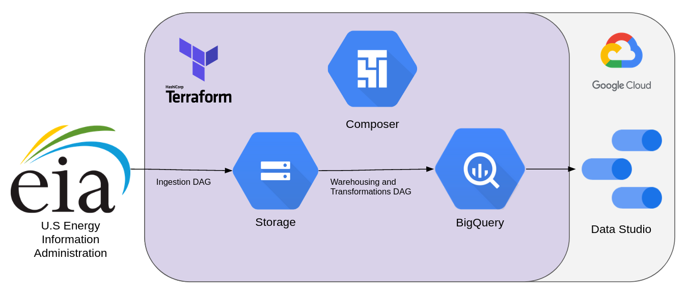

## Analysis
I wanted to explore energy consumption and emission data. [Visualization here](visualizations/energy_exploration.pdf).

Total energy consumption is fairly stable since 2000, while total emissions have seen a very slight decline. While renewable energy consumption has seen a slight increase, it is still dwarfed by fossil fuel consumption (less than 1 Quadrillion Btu, compared to roughly 6 Quadrillion Btu), which has remained fairly stable. It appears that coal, which has seen a decline in consumption starting around 2008, is being replaced partially by natural gas, which is emits about 50% as much CO2 per Btu. 

Comparing 2009 to 2022, Natural Gas gained 10% and has taken the lead from Petroleum in consumption. Coal fell 10%, getting overtaken by Nuclear.

It is worthwhile to note that a given fossil fuel's consumption and emissions follow each other nearly perfectly. That is, any increase in efficiency, measured as a decrease in CO2 emissions per Btu, is not observed from 1973 to now. This could be due to physical limitations or a lack of technological magic.

## Technology

- [Terraform](https://www.terraform.io/)
- Google Cloud Platform
	- [Cloud Composer 2](https://cloud.google.com/composer)
	- [Cloud Storage](https://cloud.google.com/storage/)
	- [BigQuery](https://cloud.google.com/bigquery/)
	- [Data Studio](https://cloud.google.com/datastudio/)
	
Terraform creates the GCP environment and uploads the DAGs. Cloud Composer runs the [ingestion DAG](dags/gcs_ingestion_dag.py) to get data from [eia.gov](https://www.eia.gov/) to the data lake (Cloud Storage). Cloud Composer then runs the [transform DAG](dags/bq_transform_dag.py) to get the data into the data warehouse (BigQuery), clean, and pivot the data. The fact table is then accessible from Data Studio for exploration and visualization.

After running `terraform apply`, the environment will be created. The DAGs will run once automatically, then the 1st of every month at 4AM.

## How to Reproduce
- Clone this repo locally
- Google Cloud Platform Setup
    - Create a GCP account.
    - Create a project with **billing enabled**.
    - Install [gcloud cli](https://cloud.google.com/sdk/docs/install) for your OS.
    - Run `gcloud auth application-default login`

- Terraform
    - Terraform will set up the entire environment and upload the DAGs to Cloud Composer.
	- [Install Terraform](https://www.terraform.io/downloads).
	- Edit [variables.tf](terraform/variables.tf):
		- Enter your billing account and region.
		- Choose a name for the default value of all other variables.
		- Do not change the "services" variable.
	- Run `terraform apply` in the [terraform](terraform) directory.
    
- Cloud Composer
    - Check out the Airflow UI:
        - Go to the [GCC Environments Page](https://console.cloud.google.com/composer/), choose your GCC Environment, and open the Airflow UI.
        - The DAGs automatically run once when uploaded (here, on `terraform apply`), and are scheduled to run on the 1st of every month at 4AM.

- [Data Studio](https://datastudio.google.com/)
